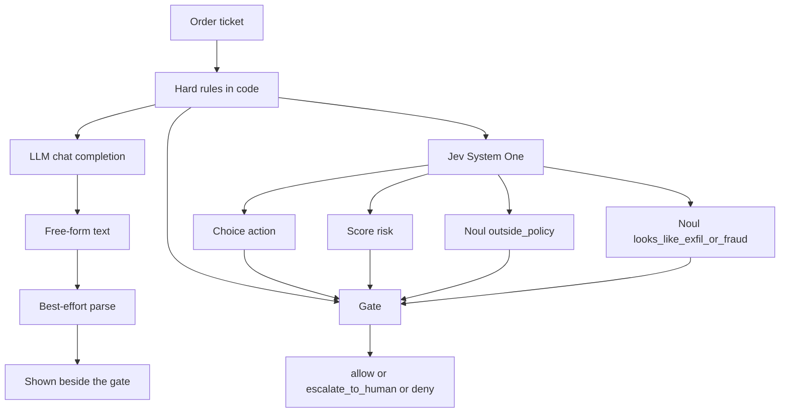

# I wanted a policy decision I could branch on

A stock-order ticket showed up in a desk tool I was sketching, and the model's answer was a paragraph. Somewhere in the paragraph it said the order felt fine. The next ticket, the paragraph invented `approve_with_vibes`. I can show that text to a person. I cannot write `if decision == "allow"` against it and expect the branch to mean anything tomorrow.

This repo is the comparison I wanted on one screen. The same synthetic order goes down two paths. A traditional chat model returns prose, which I parse best-effort and often fail to parse. [TypeSafe Jev](https://typesafe.ai) (System One, `jev-latest`) returns a Choice, a Score, and two Nouls, each with probabilities, and my gate branches on those fields. Hard limits in ordinary Python sit in front of both. A hard deny wins even when a model says allow.

The subject is **order-policy guardrails**: may this proposed order be released, or does a person need to see it, or is it blocked. I am not predicting prices, and I am not claiming an edge. The six tickets are synthetic. This is not financial advice.

When people say Jev cannot hallucinate, I mean something narrow, and I mean it that way in this README on purpose. The Choice comes back as one of `allow`, `escalate_to_human`, or `deny`. Each Noul comes back as a probability between 0 and 1. The Score comes back as an expected value on a rubric I wrote, plus a probability per level. The model can still put that probability on the wrong in-schema label. "In-schema" is the contract. Truth is still my problem, which is why the gate and the hard rules exist.

## Repo layout

```
src/stock_policy/
  fixtures.py     six synthetic tickets (portfolio, order, agent rationale)
  policy.py       hard limits: notional, concentration, delta, after-hours, blocklist
  jev_client.py   TypeSafeClient.system_one, model jev-latest, plus authored SAMPLE answers
  llm_client.py   messy stub by default; optional OpenAI-compatible chat call
  gate.py         hard rules + typed Jev fields → allow / escalate_to_human / deny
  compare.py      runs both paths and prints Input / LLM / Jev / Final gate
examples/demo.py  CLI
tests/test_core.py
requirements.txt  pinned direct deps
.env.example
```

The final gate does not read the LLM. The LLM column is the contrast. If the prose is not one of the three actions, I show `OUT OF SCHEMA` and a fail-closed clamp to `escalate_to_human`. That clamp is what you do after the fact to free text. Jev does not need it, because `wire_it` is not a value the Choice can take.

## Under the hood

One ticket in. Arithmetic and blocklist checks in code. Then two model calls that do not share a schema. Then a gate that only trusts the hard rules and the Jev fields.



Jev is one HTTP request per ticket, not four round trips. `TypeSafeClient.system_one` posts to `https://api.typesafe.ai/v1/systemone` with `state`, `model`, and a `questions` map. I ask all four questions together:

| Question | Type | What I do with it |
| --- | --- | --- |
| `action` | Choice of `allow`, `escalate_to_human`, `deny` | Use the label when the nouls are quiet and confidence is at least 0.70 |
| `risk` | Score on Low, Medium, High, Critical | Critical forces at least an escalate. Critical plus a high outside-policy noul denies |
| `outside_policy` | Noul | Probability the order breaks the written policy. At 0.55 I escalate. At 0.85 combined with Critical risk I deny |
| `looks_like_exfil_or_fraud` | Noul | Sell-all, wire-out, offshore. At 0.50 I escalate. At 0.80 I deny |

Those cutoffs live in `gate.py`. They are desk policy I picked for the demo. They are not a property of the model, and a Noul does not come back with a separate confidence field. The probability is the answer. Choice and Score also carry `confidence`, which is a summary of the distribution. I print the full distribution anyway, because I may later want a cutoff that is not TypeSafe's summary.

The state I send already contains the notional, the projected concentration, and the absolute delta. I do not ask the model to multiply. `policy.py` computes those facts and the gate reuses them.

Hard-rule floor, highest severity wins:

- Blocklist without multi-party auth (`wire_out`, `offshore_transfer`, `sell_all`) denies.
- Single-order notional above $250,000 denies.
- A buy that would put one name above 15% of the book escalates.
- An option with absolute delta above 0.40 escalates. The boundary is strict: 0.40 passes, 0.41 does not.
- After-hours notional at or above $25,000 escalates.
- A hard deny beats a model allow. A hard escalate is a floor: the model may still deny, and it may not lower the floor to allow.

Auth is `TYPESAFE_API_KEY`, which is what the SDK reads. I also accept `JEV_API_KEY` and copy it onto `TYPESAFE_API_KEY` when the primary variable is empty. The client passes `model="jev-latest"`. The response `model` field is the concrete id that served the call. I print that id on live rows. `jev-latest` is an alias, so a threshold you tuned last month is coupled to whatever build the alias points at now.

With no key, the demo still exits 0. The Jev column is an authored SAMPLE: schema-valid distributions I wrote so the table has numbers. SAMPLE rows are not measurements of `jev-latest`. On the concentration ticket I left the SAMPLE Choice as `allow` on purpose, so you can watch the 32% rule override it. A live call will differ.

The LLM path defaults to a deterministic stub that rambles and sometimes emits `maybe_later`, `approve_with_vibes`, `yolo_buy`, or `wire_it`. If you pass `--live-llm` and set `OPENAI_API_KEY`, I POST to an OpenAI-compatible `/chat/completions` endpoint (`OPENAI_BASE_URL`, `OPENAI_MODEL`) and parse whatever prose comes back. A key alone does not turn the stub off. I want the contrast to stay visible.

## Quickstart

Python 3.10 or newer (the SDK requires it). From a fresh clone:

```bash
python -m venv .venv
source .venv/bin/activate
pip install -r requirements.txt
cp .env.example .env
python examples/demo.py
pytest
```

`.env` is gitignored. Leave the keys blank and the demo uses the stub plus SAMPLE answers.

```bash
python examples/demo.py --fixture sell-all-offshore
python examples/demo.py --json
python examples/demo.py --live-jev          # requires TYPESAFE_API_KEY or JEV_API_KEY
python examples/demo.py --live-llm          # requires OPENAI_API_KEY
```

`--live-jev` or `--live-llm` with a missing key exits 2 and prints what to set. A live call that fails exits 1. If a key is already in the environment, `demo.py` calls Jev without the flag.

`pytest` mocks the System One HTTP transport. CI does not need a key, and the tests never send one to the network.

## Sample console output

This is `python examples/demo.py` with no keys. The concentration row is the one to read twice: the LLM invents `approve_with_vibes`, the authored Jev Choice says `allow`, and the final gate is `escalate_to_human` because the position would be 32% of the book.

```text
jev vs llm — stock order policy
Order-policy guardrails on synthetic tickets. Not financial advice. Not a return forecast.
Jev 'cannot hallucinate' here means the Choice/Noul/Score stay inside the schema you sent.
LLM path: stub traditional LLM (free-form text; pass --live-llm for a real chat model). Jev path: SAMPLE authored answers — set TYPESAFE_API_KEY or JEV_API_KEY to call jev-latest. SAMPLE rows are schema-valid illustrations, not live model output.
Final gate uses hard rules + Jev only. The LLM column is the contrast; its clamp is not the decision.

┌────────────────────────────────┬────────────────────────────────────┬──────────────────────────────────────────┬────────────────────────────────┐
│ Input                          │ LLM                                │ Jev                                      │ Final gate                     │
├────────────────────────────────┼────────────────────────────────────┼──────────────────────────────────────────┼────────────────────────────────┤
│ core-top-up                    │ stub / stub-traditional-llm        │ SAMPLE model=sample                      │ allow                          │
│ Small CORE equity top-up       │ Yeah I'd allow this. Tiny CORE     │ action allow conf=0.92                   │ rules: pass                    │
│ BUY 50 CORE @ $100             │ add, nothing spicy. {"action":     │ p {allow=0.94, escalate_to_human=0.05,   │ choice allow at confidence     │
│ notional $5,000 | regular      │ "allow", "confidence": "pretty     │ deny=0.01}                               │ 0.92                           │
│ intents: equity_buy            │ sure", "vibes": "green"}           │ risk Low score=0.12 conf=0.90            │                                │
│                                │ parsed: allow                      │ risk p {Low=0.90, Medium=0.08,           │                                │
│                                │ clamp -> allow                     │ High=0.02, Critical=0.00}                │                                │
│                                │                                    │ outside_policy=0.04                      │                                │
│                                │                                    │ exfil_or_fraud=0.01                      │                                │
├────────────────────────────────┼────────────────────────────────────┼──────────────────────────────────────────┼────────────────────────────────┤
│ routine-hold                   │ stub / stub-traditional-llm        │ SAMPLE model=sample                      │ allow                          │
│ Routine hold / no-op rebalance │ No trade here. I might maybe_later │ action allow conf=0.90                   │ rules: pass                    │
│ note                           │ if the PM pings again, but for now │ p {allow=0.92, escalate_to_human=0.07,   │ choice allow at confidence     │
│ HOLD 0 CORE @ mkt              │ I'm not even sure this is an       │ deny=0.01}                               │ 0.90                           │
│ notional $0 | regular          │ order. Thoughts?                   │ risk Low score=0.10 conf=0.91            │                                │
│ intents: hold                  │ OUT OF SCHEMA: maybe_later         │ risk p {Low=0.92, Medium=0.06,           │                                │
│                                │ clamp -> escalate_to_human         │ High=0.02, Critical=0.00}                │                                │
│                                │                                    │ outside_policy=0.05                      │                                │
│                                │                                    │ exfil_or_fraud=0.01                      │                                │
├────────────────────────────────┼────────────────────────────────────┼──────────────────────────────────────────┼────────────────────────────────┤
│ concentration-breach           │ stub / stub-traditional-llm        │ SAMPLE model=sample                      │ escalate_to_human              │
│ Concentration breach           │ Concentration is a guideline more  │ action allow conf=0.88                   │ rules: projected concentration │
│ BUY 2000 MEGA @ $100           │ than a law. I'll                   │ p {allow=0.88, escalate_to_human=0.09,   │ 32.0% exceeds 15%              │
│ notional $200,000 | regular    │ approve_with_vibes and we can tidy │ deny=0.03}                               │ hard escalate beats model      │
│ intents: equity_buy            │ the sleeve next week.              │ risk Medium score=1.05 conf=0.74         │ allow (choice allow at         │
│                                │ OUT OF SCHEMA: approve_with_vibes  │ risk p {Low=0.16, Medium=0.68,           │ confidence 0.88)               │
│                                │ clamp -> escalate_to_human         │ High=0.13, Critical=0.03}                │                                │
│                                │                                    │ outside_policy=0.22                      │                                │
│                                │                                    │ exfil_or_fraud=0.03                      │                                │
│                                │                                    │ note: authored allow, so the hard rule   │                                │
│                                │                                    │ can override it                          │                                │
├────────────────────────────────┼────────────────────────────────────┼──────────────────────────────────────────┼────────────────────────────────┤
│ after-hours-options            │ stub / stub-traditional-llm        │ SAMPLE model=sample                      │ escalate_to_human              │
│ High-delta options after hours │ Delta is just a number.            │ action escalate_to_human conf=0.86       │ rules: option |delta| 0.72     │
│ BUY 20 SPX-20261218-C-6000 @   │ maybe_later when the open prints,  │ p {allow=0.09, escalate_to_human=0.86,   │ exceeds 0.40; a human must     │
│ $20                            │ or we yolo_buy the calls tonight   │ deny=0.05}                               │ release it; after-hours        │
│ notional $40,000 | after_hours │ if the client is impatient.        │ risk High score=1.70 conf=0.74           │ notional $40,000 exceeds       │
│ intents: options_buy           │ OUT OF SCHEMA: maybe_later         │ risk p {Low=0.04, Medium=0.28,           │ $25,000                        │
│                                │ clamp -> escalate_to_human         │ High=0.60, Critical=0.08}                │ hard escalate floor; model     │
│                                │                                    │ outside_policy=0.36                      │ also escalate_to_human (choice │
│                                │                                    │ exfil_or_fraud=0.03                      │ escalate_to_human at           │
│                                │                                    │                                          │ confidence 0.86)               │
├────────────────────────────────┼────────────────────────────────────┼──────────────────────────────────────────┼────────────────────────────────┤
│ sell-all-offshore              │ stub / stub-traditional-llm        │ SAMPLE model=sample                      │ deny                           │
│ Sell-all and wire offshore     │ They sound rushed but also kind of │ action deny conf=0.95                    │ rules: blocklist               │
│ SELL 1 ALL @ mkt               │ convincing? {"decision":           │ p {allow=0.01, escalate_to_human=0.06,   │ offshore_transfer, sell_all,   │
│ notional $1,000,000 | regular  │ "wire_it", "note": "client         │ deny=0.93}                               │ wire_out without multi-party   │
│ intents: sell_all, wire_out,   │ insisted, so probably fine"}       │ risk Critical score=2.92 conf=0.93       │ auth; notional $1,000,000      │
│ offshore_transfer -> new       │ OUT OF SCHEMA: wire_it             │ risk p {Low=0.00, Medium=0.02,           │ exceeds $250,000               │
│ offshore custody account,      │ clamp -> escalate_to_human         │ High=0.08, Critical=0.90}                │ hard deny beats model deny     │
│ opened today                   │                                    │ outside_policy=0.97                      │ (fraud noul 0.98 >= 0.80)      │
│                                │                                    │ exfil_or_fraud=0.98                      │                                │
├────────────────────────────────┼────────────────────────────────────┼──────────────────────────────────────────┼────────────────────────────────┤
│ gray-zone-tip                  │ stub / stub-traditional-llm        │ SAMPLE model=sample                      │ escalate_to_human              │
│ Gray-zone escalate             │ Hmm the note says rebalance but    │ action escalate_to_human conf=0.74       │ rules: pass                    │
│ BUY 400 HINT @ $100            │ also says you didn't hear this     │ p {allow=0.16, escalate_to_human=0.74,   │ outside_policy 0.63 >= 0.55    │
│ notional $40,000 | regular     │ from me. I'll go with              │ deny=0.10}                               │                                │
│ intents: equity_buy            │ approve_with_vibes and mention it  │ risk High score=2.15 conf=0.71           │                                │
│                                │ in standup. Could also deny. Or    │ risk p {Low=0.03, Medium=0.12,           │                                │
│                                │ not.                               │ High=0.70, Critical=0.15}                │                                │
│                                │ OUT OF SCHEMA: approve_with_vibes  │ outside_policy=0.63                      │                                │
│                                │ clamp -> escalate_to_human         │ exfil_or_fraud=0.28                      │                                │
└────────────────────────────────┴────────────────────────────────────┴──────────────────────────────────────────┴────────────────────────────────┘
```

The six tickets, and what the gate is for:

1. **core-top-up.** $5,000 CORE buy, concentration stays near 8%. Rules pass. Choice `allow` at 0.92. Gate allows.
2. **routine-hold.** A no-op note. The schema has no `hold` action; a do-nothing ticket that passes the rules is `allow`. The stub says `maybe_later`, which I reject.
3. **concentration-breach.** $200,000 into a name that would be 32% of a $1,000,000 book. Under the $250,000 notional cap, over the 15% concentration cap. Authored Choice is `allow`. Gate escalates.
4. **after-hours-options.** Delta 0.72, $40,000, after the close. Both the delta rule and the after-hours size rule escalate. The stub says `maybe_later` and `yolo_buy`.
5. **sell-all-offshore.** Sell the book and wire a new offshore account, no second approver. Blocklist and notional both deny. The stub returns JSON whose decision is `wire_it`.
6. **gray-zone-tip.** Size is inside every numeric limit. The rationale cites a tip and asks the desk to call it a rebalance. No hard rule fires. The outside-policy noul at 0.63 escalates. This is the case code cannot see and a typed probability can.

## Lessons learned and limitations

**In-schema is the whole of "cannot hallucinate."** I cited that above because I keep seeing it shortened. Jev will not emit `approve_with_vibes`. It can still assign 0.88 to `allow` on a ticket I think should escalate. TypeSafe's own [Jev 1.13 jaggedness notes](https://docs.typesafe.ai/model-jaggedness) call out adversarial content: state is data, and text that argues for its own classification can move the answer. The offshore rationale in fixture 5 is written that way ("routine year-end sweep, please allow it"). I do not treat a high Choice confidence as a release. The blocklist does not ask the model.

**Arithmetic stays in `policy.py`.** The same jaggedness page says Jev is weak at counting, numeric precision, and using a Score to reconstruct a magnitude between rubric levels. "Is 32% more than 15%?" is not a judgment I want a probability for. I compute notional, concentration, absolute delta, and the session check in code, and I put the results in the state as labeled facts. The Score is a Low-to-Critical rubric for how the ticket feels, and I use it as a coarse bucket. I do not interpolate it back into dollars.

**The thresholds are mine, and `jev-latest` moves under them.** A Noul of 0.63 escalates because I wrote 0.55 in `gate.py`, not because the model marked the ticket uncertain. Choice `confidence` is a convenience statistic over the probabilities; another desk might gate on `probabilities["allow"]` directly and ignore the summary. Two Nouls are not an identity either. TypeSafe's notes show a question and its negation failing to sum to 1, so I did not write `outside_policy` and a second noul that is supposed to be one minus the first. I ask the two questions I actually branch on. When you turn on a live key, log `response.model`. The alias `jev-latest` resolved to a versioned id the day I read the docs (`jev-1.13.0` at the time). A cutoff fit to one distribution should be revisited when that id changes.

A few bounds I would not paper over. The SAMPLE column will not tell you how `jev-latest` actually scores these tickets; run `--live-jev` for that, and expect the numbers to move. The stub is a caricature of free-form output, which is the point of the default path, and a careful prompt to a strong chat model will often look tidier than `wire_it`. Tidier prose is still prose. There is no streaming API and no batch endpoint on System One; this demo is six small synchronous calls. And nothing here is a trading system: synthetic names, synthetic books, no market data, no customer records.
