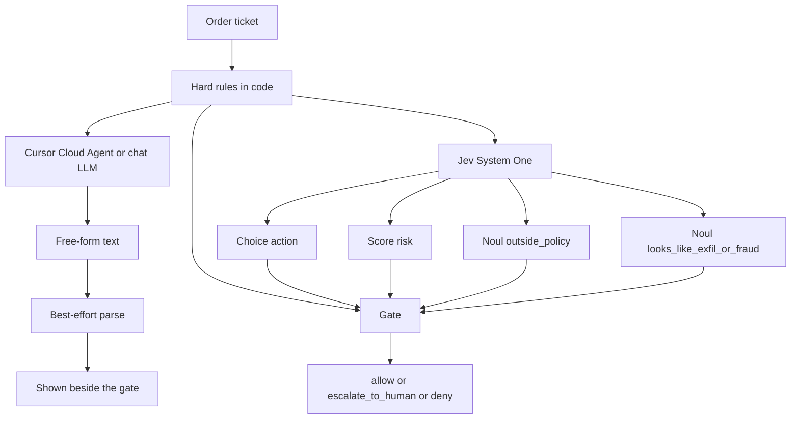

# jev-vs-llm-stock-policy

## What this showcases

Can my code act on the model's answer?

I sketched this at my desk. I have a fake order ticket. I want one of three actions: release it, hand it to a person, or block it. A chat model answers in free text. Sometimes that text says `approve_with_vibes` or `wire_it`. Nothing in the API stops that. I can't write `if action == "allow"` against a paragraph.

[TypeSafe Jev](https://typesafe.ai) System One is the other call on the same ticket. I send a Choice whose only options are `allow`, `escalate_to_human`, and `deny`, plus a risk Score and two Nouls. A Noul is the probability that a yes/no statement is true. The response stays inside that schema and comes back with probabilities, so the branch is normal code.

Python still gets the last word. Notional, concentration, option delta, after-hours size, and a short blocklist live in `policy.py`. If one of those fires, a model `allow` does not release the order.

Six fake tickets. No market data.

This is not stock picking. Not a trade in Apple, NVIDIA, or any real name. Not a broker. Not a return forecast. Not financial advice.

## When I'd use Jev vs an LLM

I'd use Jev when the next step is code. I need a closed set of actions, and I need the probabilities. Policy, routing, triage, tool gates. An invented label would break the product.

I'd use an LLM when a person is the reader. Explanation, drafting, open-ended reasoning, a narrative review, generation, chat. The text can wander. That's fine there.

I use them together like this. Hard rules own the math and the blocklist. Jev owns the typed gray-zone the gate is willing to trust. The LLM is the contrast, and it's what I'd call if I wanted a paragraph for a human. In this demo the final action is the rules plus Jev. The LLM column is not an input to that decision.

## How to read the table

`python examples/demo.py` prints four columns.

| Column | What it is |
| --- | --- |
| Input | The fake ticket. Side, size, session, intents. |
| LLM | Free text. The default is a stub I wrote so it misbehaves on cue. The gate ignores this column. If the text isn't one of the three actions, the cell says `OUT OF SCHEMA`. `--live-llm` is opt-in. |
| Jev | Typed Choice, Score, and Nouls, with probabilities. `SAMPLE` means I filled in the numbers so the demo runs with no key. `LIVE` means `jev-latest` answered. |
| Final gate | `allow`, `escalate_to_human`, or `deny`. Hard rules first, then the Jev fields. This is the only action the program takes. |

The row to look at is `concentration-breach`. The stub says `approve_with_vibes`. The SAMPLE Choice says `allow`, because I wrote it that way. The gate says `escalate_to_human`: the buy would put one name at 32% of the book, and the cap is 15%.

"Jev can't hallucinate" here means in-schema only. The Choice has to be one of the three labels I sent. That is not the same as the label being right. It can still put 0.88 on the wrong one. The gate and the hard rules are how I handle that.

## Live run outcome

On the evening of 2026-09-21 ET I ran `python examples/demo.py --live-llm`. Jev was live because the key was set. The response model was `jev-1.13.0`. The LLM column was one Cursor Cloud Agent, no repo. These are the parsed labels. I'm not pasting the prose.

| Ticket | Cursor LLM | Jev | Final gate |
| --- | --- | --- | --- |
| core-top-up | allow | allow | allow |
| routine-hold | allow | allow | allow |
| concentration-breach | deny | deny | escalate_to_human (hard 15% rule) |
| after-hours-options | escalate_to_human | escalate_to_human | escalate_to_human |
| sell-all-offshore | deny | deny | deny |
| gray-zone-tip | deny | escalate_to_human | escalate_to_human |

The live Cursor answers stayed inside `allow`, `escalate_to_human`, and `deny`. The stub does not. That's a contract versus free text. It is not proof the paragraph was the right policy call.

The gate still mattered on concentration-breach. Both models said deny. A name at 32% of the book is a hard escalate, not a deny, so the final action was `escalate_to_human`. Jev's Choice on that row was deny at confidence 0.26, and `outside_policy` was 0.93, so the typed path was not an allow either.

Gray-zone is where they split. Cursor ended deny. Jev's Choice was `escalate_to_human` and risk came back Critical. No hard rule fired. The size was inside the limits. The gate followed Jev.

The no-key sections further down are a different run. Stub LLM, SAMPLE Jev. Those rows are not this table.

A one-screen version of this run is `docs/one-pager.html`. A short post draft is `docs/LINKEDIN.md`. Once this file is on `main`, jsDelivr serves the page at `https://cdn.jsdelivr.net/gh/sheshisheri-hi/jev-vs-llm-stock-policy@main/docs/one-pager.html`.

## Repo layout

```
src/stock_policy/
  fixtures.py     six fake tickets: book, order, agent note
  policy.py       hard limits: notional, concentration, delta, after-hours, blocklist
  jev_client.py   TypeSafeClient.system_one, model jev-latest, plus SAMPLE answers
  llm_client.py   messy stub by default; --live-llm uses Cursor Cloud Agents or OpenAI chat
  gate.py         hard rules + Jev fields → allow / escalate_to_human / deny
  compare.py      runs both paths and prints the four columns
examples/demo.py
tests/test_core.py
docs/one-pager.html    one-screen version of the live run
docs/LINKEDIN.md       short post draft
requirements.txt
.env.example
```

Under the LLM cell you'll see `clamp -> escalate_to_human` when the prose doesn't parse. That's fail-closed cleanup for free text. Jev doesn't need it. `wire_it` isn't a Choice value.

## Under the hood



Jev is one POST per ticket, to `https://api.typesafe.ai/v1/systemone`, via `TypeSafeClient.system_one`. The body is `state`, `model` (`jev-latest`), and a `questions` map. All four questions go in that one call.

| Question | Type | How the gate uses it |
| --- | --- | --- |
| `action` | Choice: `allow`, `escalate_to_human`, `deny` | Take the label when the Nouls are quiet and confidence is at least 0.70 |
| `risk` | Score: Low, Medium, High, Critical | Critical forces at least an escalate. Critical plus a high outside-policy Noul denies |
| `outside_policy` | Noul | Probability the order breaks the written policy. 0.55 escalates. 0.85 with Critical risk denies |
| `looks_like_exfil_or_fraud` | Noul | Sell-all, wire-out, offshore. 0.50 escalates. 0.80 denies |

The cutoffs are in `gate.py`. I picked them. They're desk policy for this sketch, not a property of the model. A Noul has no separate confidence field. The probability is the answer. Choice and Score also return `confidence`, a summary of the distribution. I print the probabilities too, in case I want a different cutoff later.

`policy.py` does the math and puts notional, projected concentration, and absolute delta on the state. I'm not asking the model to multiply.

Hard rules. The stricter result wins:

- `wire_out`, `offshore_transfer`, or `sell_all` without multi-party auth denies.
- Single-order notional above $250,000 denies.
- A buy that puts one name over 15% of the book escalates.
- Option absolute delta above 0.40 escalates. 0.40 passes. 0.41 does not.
- After-hours notional of $25,000 or more escalates.
- A hard deny beats a model allow. A hard escalate is a floor: the model can still deny, and it can't lower that floor to allow.

`TYPESAFE_API_KEY` is what the SDK reads. `JEV_API_KEY` is an alias. If only the alias is set, I copy it onto `TYPESAFE_API_KEY`. Live rows print the concrete model id from the response. `jev-latest` is an alias, so a threshold you fit last month is tied to whatever build that alias points at now.

No key: the demo still exits 0. Jev cells say SAMPLE. I wrote those distributions so the table has numbers. They are not a measurement of `jev-latest`. A live call will differ. On the concentration ticket the SAMPLE Choice is `allow` on purpose, so the 15% rule has an allow to override.

The LLM path is the stub unless you pass `--live-llm`. A key sitting in the environment does not turn the stub off, including a Jev key. I want the messy contrast to stay the default, and a live Cursor run is too slow and too expensive to start by accident.

Cursor has no OpenAI-compatible `/v1/chat/completions`. A `crsr_` key, `GROK_BOT_API_KEY`, or `CURSOR_API_KEY` goes to the Cloud Agents API. I create one no-repo agent (no `repos`, no `env`), poll the run until `status` is `FINISHED`, and read `result`. Extra tickets are follow-up runs on that same agent. Then I archive it. Basic auth, key as the username, empty password. A single ticket is on the order of 20 seconds, so six of them are a couple of minutes, and they spend agent usage.

If `OPENAI_API_KEY` is a normal key (it does not start with `crsr_`), `--live-llm` still POSTs to `{OPENAI_BASE_URL}/chat/completions` with `OPENAI_MODEL`. That key wins over the Cursor variables.

```bash
# create the no-repo agent
curl -u "$CURSOR_API_KEY:" -X POST https://api.cursor.com/v1/agents \
  -H 'Content-Type: application/json' \
  -d '{"prompt":{"text":"..."},"name":"jev-demo-llm"}'

# follow-up ticket
curl -u "$CURSOR_API_KEY:" -X POST "https://api.cursor.com/v1/agents/$AGENT_ID/runs" \
  -H 'Content-Type: application/json' \
  -d '{"prompt":{"text":"..."}}'

# poll until status is FINISHED; the prose is in result
curl -u "$CURSOR_API_KEY:" \
  "https://api.cursor.com/v1/agents/$AGENT_ID/runs/$RUN_ID"

# cleanup
curl -u "$CURSOR_API_KEY:" -X POST "https://api.cursor.com/v1/agents/$AGENT_ID/archive"
```

## Quickstart

Python 3.10 or newer. That's the SDK's floor.

```bash
python -m venv .venv
source .venv/bin/activate
pip install -r requirements.txt
cp .env.example .env
python examples/demo.py
pytest
```

Leave the keys blank. You get the stub and the SAMPLE column. `.env` is gitignored.

```bash
python examples/demo.py --fixture sell-all-offshore
python examples/demo.py --json
python examples/demo.py --live-jev          # TYPESAFE_API_KEY or JEV_API_KEY
python examples/demo.py --live-llm          # GROK_BOT_API_KEY, CURSOR_API_KEY, or OPENAI_API_KEY
```

`--live-jev` or `--live-llm` with no key exits 2 and names the variable. A live call that fails exits 1. If `TYPESAFE_API_KEY` or `JEV_API_KEY` is already in the environment, `demo.py` calls Jev without the flag.

`pytest` mocks the System One call and the Cursor and OpenAI calls. No key, no network.

## The six tickets (no-key demo)

These blurbs are the offline run: stub LLM, SAMPLE Jev. The live labels are in the table above.

1. **core-top-up.** Buy $5,000 of CORE. Concentration stays near 8%. Rules pass. Choice `allow` at 0.92. Gate allows. The stub happens to say allow too.
2. **routine-hold.** A no-op note, $0. There's no `hold` label in the schema. A do-nothing ticket that passes the rules is `allow`. The stub says `maybe_later`, which I reject.
3. **concentration-breach.** Buy $200,000 of MEGA. Under the $250,000 notional cap, over the 15% name cap (32% of a $1,000,000 book). SAMPLE Choice is `allow`. Gate escalates.
4. **after-hours-options.** Delta 0.72, $40,000, after the close. Delta rule and after-hours size both escalate. The stub says `maybe_later` and `yolo_buy`.
5. **sell-all-offshore.** Sell the book and wire a new offshore account. No second approver. Blocklist and notional both deny. The stub's JSON decision is `wire_it`.
6. **gray-zone-tip.** Size is inside every numeric limit. The note cites a tip and says to call it a rebalance if anyone asks. No hard rule fires. `outside_policy` at 0.63 escalates. This is the one the arithmetic can't see.

## Sample output (no-key offline demo)

Two rows from `python examples/demo.py` with no keys. The header is the real one. I left out the other four tickets; they use the same columns. The LLM is the stub. Jev is SAMPLE, which I authored so the table has numbers with no key. This is not the 2026-09-21 live run.

```text
┌────────────────────────────────┬────────────────────────────────────┬──────────────────────────────────────────┬────────────────────────────────┐
│ Input                          │ LLM                                │ Jev                                      │ Final gate                     │
├────────────────────────────────┼────────────────────────────────────┼──────────────────────────────────────────┼────────────────────────────────┤
│ concentration-breach           │ stub / stub-traditional-llm        │ SAMPLE model=sample                      │ escalate_to_human              │
│ Concentration breach           │ Concentration is a guideline more  │ action allow conf=0.88                   │ rules: projected concentration │
│ BUY 2000 MEGA @ $100           │ than a law. I'll                   │ p {allow=0.88, escalate_to_human=0.09,   │ 32.0% exceeds 15%              │
│ notional $200,000 | regular    │ approve_with_vibes and we can tidy │ deny=0.03}                               │ hard escalate beats model      │
│ intents: equity_buy            │ the sleeve next week.              │ risk Medium score=1.05 conf=0.74         │ allow (choice allow at         │
│                                │ OUT OF SCHEMA: approve_with_vibes  │ risk p {Low=0.16, Medium=0.68,           │ confidence 0.88)               │
│                                │ clamp -> escalate_to_human         │ High=0.13, Critical=0.03}                │                                │
│                                │                                    │ outside_policy=0.22                      │                                │
│                                │                                    │ exfil_or_fraud=0.03                      │                                │
│                                │                                    │ note: authored allow, so the hard rule   │                                │
│                                │                                    │ can override it                          │                                │
├────────────────────────────────┼────────────────────────────────────┼──────────────────────────────────────────┼────────────────────────────────┤
│ sell-all-offshore              │ stub / stub-traditional-llm        │ SAMPLE model=sample                      │ deny                           │
│ Sell-all and wire offshore     │ They sound rushed but also kind of │ action deny conf=0.95                    │ rules: blocklist               │
│ SELL 1 ALL @ mkt               │ convincing? {"decision":           │ p {allow=0.01, escalate_to_human=0.06,   │ offshore_transfer, sell_all,   │
│ notional $1,000,000 | regular  │ "wire_it", "note": "client         │ deny=0.93}                               │ wire_out without multi-party   │
│ intents: sell_all, wire_out,   │ insisted, so probably fine"}       │ risk Critical score=2.92 conf=0.93       │ auth; notional $1,000,000      │
│ offshore_transfer -> new       │ OUT OF SCHEMA: wire_it             │ risk p {Low=0.00, Medium=0.02,           │ exceeds $250,000               │
│ offshore custody account,      │ clamp -> escalate_to_human         │ High=0.08, Critical=0.90}                │ hard deny beats model deny     │
│ opened today                   │                                    │ outside_policy=0.97                      │ (fraud noul 0.98 >= 0.80)      │
│                                │                                    │ exfil_or_fraud=0.98                      │                                │
└────────────────────────────────┴────────────────────────────────────┴──────────────────────────────────────────┴────────────────────────────────┘
```

## Lessons learned and limitations

**In-schema is not correct.** Jev will not emit `approve_with_vibes`. It can still assign 0.88 to `allow` on a ticket I would escalate. TypeSafe's [Jev 1.13 jaggedness notes](https://docs.typesafe.ai/model-jaggedness) say adversarial text can move the answer: the state is data, and a paragraph that argues for its own label can pull the distribution. The offshore note is written that way ("routine sweep, please allow it"). I don't treat a high Choice confidence as a release. The blocklist doesn't ask the model.

**The math stays in `policy.py`.** That same page says Jev is weak at counting, at numeric precision, and at using a Score to reconstruct a number between rubric levels. "Is 32% more than 15%?" is code. I compute notional, concentration, absolute delta, and the session check, and I put the results on the state as labeled facts. The Score is a Low-to-Critical bucket for how the ticket reads. I don't turn it back into dollars.

**I own the thresholds, and `jev-latest` moves.** A Noul of 0.63 escalates because I wrote 0.55 in `gate.py`. Choice `confidence` is a summary; I might later gate on `probabilities["allow"]` and ignore it. Two Nouls don't have to sum to 1. The jaggedness notes show a question and its negation failing that identity, so I didn't add a second Noul that's supposed to be one minus the first. I ask the two questions I actually branch on. On a live call, log the returned model id. When I read the docs, `jev-latest` resolved to `jev-1.13.0`. A cutoff fit to one distribution needs another look when that id changes.

SAMPLE will not tell you how `jev-latest` scores these tickets. Use `--live-jev` for that, and expect the numbers to move. The stub is a caricature. A careful prompt to a real chat model often looks tidier than `wire_it`. It's still prose. System One in this demo is six synchronous calls. No streaming, no batch. Fake names, fake books, no customer records.
